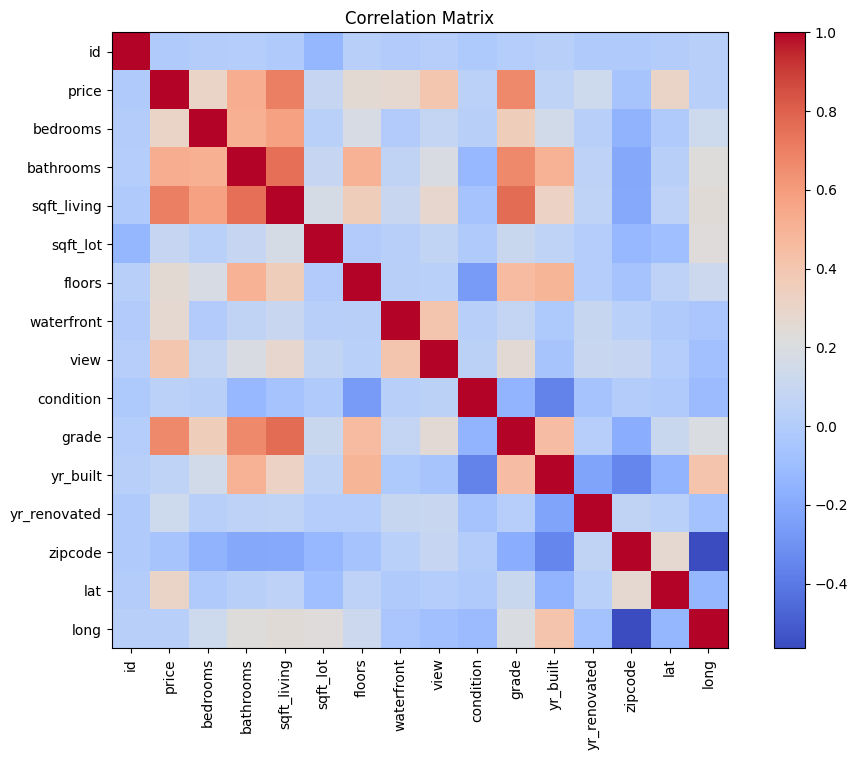

# House Price Prediction
Dataset source: https://www.kaggle.com/datasets/harlfoxem/housesalesprediction/data

## Cleaning Steps
1. After the data was loaded, the data was checked for missing values. If there is missing value, data imputation or drop data is required.
2. Set `price` variable as target variables
3. Explore the data with correlation matrix to find out the features that are highly correlated to the target variable. 
4. We can observe that `bedrooms`, `bathrooms`, `sqft_living`, `view` and `grade` have strong correlation to `price`. 
5. Remove unnecessary columns such as `id`, `date`, `zipcode` because they do not have impact to the target variables.
6. Identify categorical variables and encode it with one hot encoding. This is to allow machine learning model to understand the value of categorical features.
7. Split the data into training set and testing set, by 80%-20%
8. Normalize numerical feature with `StandardScaler`.

## Model training
1. xgboost is used for model training, it performs better compared to linear regression because it can capture non-linear patterns, while linear regression only captures linear relationship. Xgboost can also handle irregular relationship, this because it is an ensemble model that combine many decision trees.
2. xgboost can handle outliers very well because it is based on tree-based models.
3. It works well with categorical (one hot encoding) & numerical data.
4. It will prevent overfitting with regularization such as L1 & L2 regularization.
5. It achieved R2 score of 0.85, indicating that the model performs well on test set.
6. RMSE shown 149570, indicating the price predicted differs from actual price by 150k. It predicts well if the price of the house is more than 500k.

## Setup instruction

1. install packages with `pip install -r requirements.txt`
2. start the demo with `python main.py`

## Improvements for real estate company.
1. Provide property recommendation to users based on their preference such as preferred location, budget, size.
2. Provide recommendation for selling price based on the features of a property, this would reduce the time taken to evaluate property market price.
3. Improve prediction accuracy by training with more data from various reliable sources.
